# Hubble SQL Workbench 利用ガイド

このドキュメントは **Hubble SQL Workbench**（以下 Hubble）を使って SQL を実行する
分析者とエンジニア向けの操作マニュアルです。Trino、MySQL、PostgreSQL のいずれかに
接続してクエリを投げられます。Hue の Notebook を使ったことがある方なら、ほぼ同じ
感覚で使えます。

- 運用者（ホスト担当）向けの導入・設定は [`operations.md`](operations.md) を参照してください。

---

## 1. はじめに

Hubble は Trino、MySQL、PostgreSQL に対応した SQL ワークベンチです。Trino を
第一級サポートとし、SQL 補完 (ANTLR) と Query Guard の事前見積りは Trino のみ
対応です。複数のセルを持つ Notebook に SQL を書き、セルごとに実行して結果を
グリッドとチャートで確認できます。クエリ、結果、履歴はブラウザではなくサーバー側に
保存され、別の端末からでも同じ Notebook を開けます。

おおまかな使い方の流れは次のとおりです。

1. 左サイドバーの **Data** ツリーからカタログ・スキーマ・テーブルを探す。
2. テーブル名・カラム名をクリックしてエディターに挿入、または SELECT 雛形を作る。
3. 上部バーの **catalog.schema** セレクタで対象のスキーマを選ぶ。
4. SQL を書いて **Ctrl/Cmd+Enter** または セル左の ▶ で実行。
5. 結果を **Grid / Chart / Explain / Details** タブで確認し、必要なら CSV / XLSX ダウンロードか外部エクスポート。
6. **Ctrl/Cmd+S** で Notebook を保存。

---

## 2. 画面の各部

画面は大きく 3 つに分かれます。

### 2.1 TopBar（上部バー）

左から順に、

- **Hubble ロゴ**
- **Notebook タブ** — 開いている Notebook が並びます。タブをダブルクリックで名前変更、
  × で閉じる（未保存の変更があると確認ダイアログ）、+ で新規 Notebook。
- **catalog.schema セレクタ** — クエリの既定のカタログ・スキーマ。FQN（例
  `tpch.tiny.nation`）を書かないテーブルはここの値が補われます。最近使った値が復元されます。
- **Run / Stop ボタン** — Notebook の全セルを上から順に実行します。実行中は **Stop** に
  変わり、押すと実行中のセルをキャンセルします（Ctrl/Cmd+Enter のツールチップ表示は
  「アクティブセルの実行」を指します。後述）。
- **Save ボタン** — Notebook を保存します。
- **コマンドパレット**（⌘ アイコン, Ctrl/Cmd+K）・**テーマ切替**（月/太陽アイコン）。
- **ユーザー表示** — SSO（proxy）環境でのみ表示されます（[§14](#14-sso-環境での表示)）。

### 2.2 サイドバー（4 パネル）

左端のアイコンレール（Data / Notebooks / Saved / History）で 4 つのパネルを切り替えます。
同じアイコンをもう一度押すとサイドバーを畳めます。パネルの右端をドラッグすると幅を
変えられます。

| パネル        | 内容                                                                       |
| ------------- | -------------------------------------------------------------------------- |
| **Data**      | カタログ → スキーマ → テーブル → カラムのツリー（[§9](#9-データブラウザ)） |
| **Notebooks** | 保存済み Notebook の一覧・検索・再オープン                                 |
| **Saved**     | 保存クエリの一覧・お気に入り・挿入（[§10](#10-履歴と保存クエリ)）          |
| **History**   | 実行履歴（state チップで絞り込み、再実行）                                 |

各パネル上部には検索フィールドがあります（History は state チップで絞るため検索欄なし）。

### 2.3 Notebook ビュー

中央のスクロール領域にセルが縦に並びます。各 SQL セルは「ツールバー → エディター →
進捗/統計ストリップ → 結果ペイン」という構成です。末尾には **[+ SQL]** **[+ Markdown]**
の追加ボタンがあります。`${…}` 変数を含むときは、ビュー上部に変数パネルが現れます。

---

## 3. クエリの実行

### 3.1 実行の単位

SQL セルで **Ctrl/Cmd+Enter** を押すと、

- **テキストを選択している場合** → その選択範囲だけを実行します。
- **選択していない場合** → カーソル位置のステートメント（`;` 区切りで判定）を実行します。

セルツールバーの ▶（Run cell）ボタンは **セル内の全ステートメント**を上から順に実行します
（`;` で分割し、エラーが出たらそこで停止）。

### 3.2 ガターアイコン（ステートメント単位の状態と実行）

エディター左のガターには、ステートメントごとに状態アイコンが表示されます
（idle / executing / done / failed）。カーソルのあるステートメントが「アクティブ」として
強調されます。**ガターのアイコンをクリックすると、そのステートメントだけを実行**できます。

### 3.3 全セルの実行

TopBar の **Run** ボタン、またはコマンドパレットの **Run all cells** で、Notebook の
全セルを上から順に実行します。

### 3.4 キャンセル

実行中は、

- セルツールバーの ▶ が ■（Stop）に変わります。
- 進捗ストリップの **Cancel** ボタン、または TopBar の **Stop** でもキャンセルできます。

キャンセルは Trino 側の実行にも伝播します。

### 3.5 進捗と統計

実行を開始すると、エディターの下に進捗バーと統計ストリップが出ます。表示項目は
**state / progress%（実行中）/ elapsed / rows / bytes / splits（完了/全体）/ peak mem** です。
右側の **Trino UI** リンクから、その実行を Trino の Web UI で開けます。

### 3.6 LIMIT の自動付加とトグル

LIMIT を持たない `SELECT` には、実行時に自動で LIMIT が付きます（既定 5000、サーバー設定
に依存）。セルツールバー右の **LIMIT** バッジで挙動を制御します。

- **LIMIT** の文字をクリック → 自動付加の ON/OFF を切り替え（OFF にすると取り消し線表示）。
- 数値をクリック → このセルの LIMIT 値をその場で編集。

### 3.7 EXPLAIN

結果ペインの **Explain** タブを開くと、カーソル位置のステートメントに対して `EXPLAIN` を
実行し、分散プランを表示します。SQL を編集すると EXPLAIN 結果は無効化されます。

---

## 4. Notebook 操作

### 4.1 セルの追加・削除・並べ替え・折りたたみ

- **追加** — ビュー末尾の [+ SQL] / [+ Markdown]、またはコマンドパレットの
  「New SQL cell」「New Markdown cell」。
- **削除** — セルツールバーのゴミ箱アイコン（内容があるときは確認）。
- **並べ替え** — ツールバーの ▲▼ で上下移動、または右端のグリップ（⋮⋮）を**ドラッグ**。
- **折りたたみ** — ツールバー左の ▸/▾。畳むとエディターと結果が隠れます。
- **名前付け** — セル名を**ダブルクリック**してインライン編集。

### 4.2 Markdown セル

Markdown セルはプレビューを表示します。クリック（または編集ボタン）でモノスペースの
テキストエリアに切り替わり、ブラウー（フォーカスを外す）で再びプレビューに戻ります。

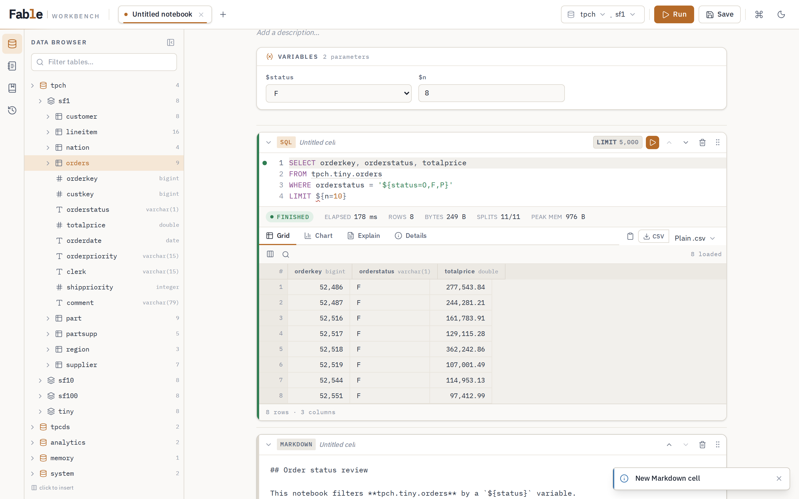

### 4.3 保存 / Save As / 自動保存

- **保存（Ctrl/Cmd+S, Save ボタン）** — サーバーに保存します。まだ一度も保存していない
  下書き（draft）は、名前を尋ねるダイアログが出ます。
- **Save As** — コマンドパレットの「Save notebook as…」から、別名で複製保存します。
- **自動保存** — 一度保存した Notebook は、編集が止まってから **2 秒**後に自動で保存
  （PUT）されます。未保存の下書きはブラウザの localStorage に保持され、次回復元されます。

### 4.4 タブ

複数の Notebook をタブで同時に開けます。タブのダブルクリックで名前変更、× で閉じます。

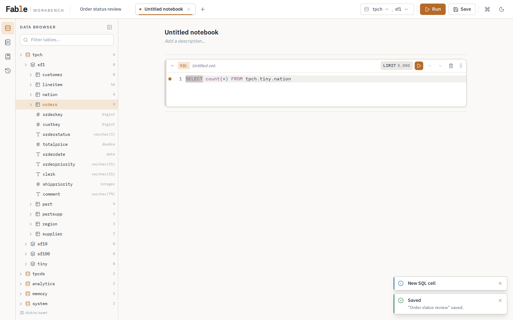

---

## 5. 変数（パラメーター）

SQL に `${…}` を書くと、実行前に値を差し込めるパラメーターになります（Hue 互換）。
変数を検出すると Notebook ビュー上部に**変数パネル**が現れます。

### 5.1 4 つの構文

| 構文                     | 意味                           |
| ------------------------ | ------------------------------ |
| `${name}`                | 既定値なしのプレースホルダ     |
| `${name=default}`        | 既定値つき                     |
| `${name=opt1,opt2,…}`    | 選択肢（値＝ラベル）のセレクト |
| `${name=label(value),…}` | ラベルつき選択肢のセレクト     |

- `--` や `/* */` の**コメント内**の `${…}` は変数として扱いません。
- **文字列リテラル内**の `${…}` は変数として扱います（例
  `WHERE s = '${status=O,F,P}'`）。Hue と同じく SQL がパースされる前に置換されます。
- 値も既定値もない変数があると、その実行はブロックされます。

### 5.2 型推論

既定値の見た目から入力ウィジェットの型が推論されます（[§5.1] の最終行）。

| 既定値の形                      | 入力欄の型     |
| ------------------------------- | -------------- |
| 選択肢あり                      | select         |
| `true` / `false`                | checkbox       |
| `YYYY-MM-DD HH:MM(:SS)` / `…T…` | datetime-local |
| `YYYY-MM-DD`                    | date           |
| 数値                            | number         |
| それ以外 / 空                   | text           |

### 5.3 変数パネル

各変数は推論された型の入力欄として並びます。**入力欄で Ctrl/Cmd+Enter** を押すと、
アクティブなセルを実行します。入力した値はパネルが消えても名前で保持されます。

---

## 6. 結果の見方

結果ペインは **Grid / Chart / Explain / Details** のタブ構成で、セルごとに状態を保持します。
エラー時は、タブの上に赤いエラーバナーが出ます（`line N:M` はエディターのマーカーにも反映）。

### 6.1 グリッド

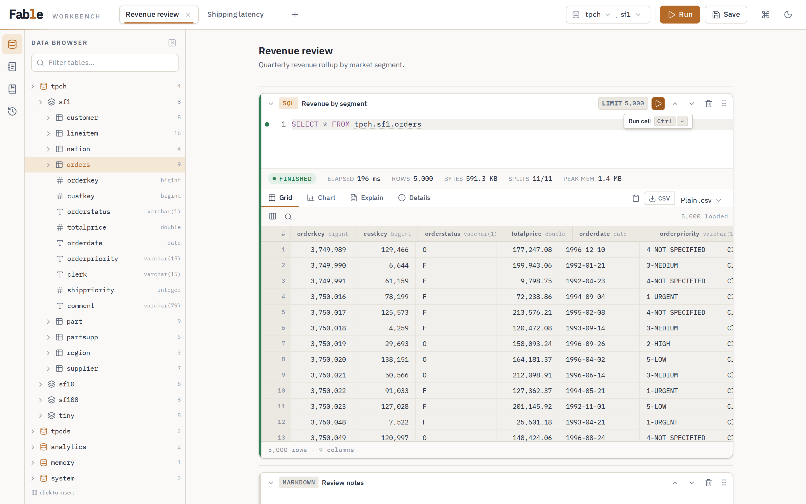

- 仮想スクロールの高密度グリッド（固定ヘッダー、行番号列、28px 行高）。行は実行しながら
  追加で流れ込みます。`NULL` は薄い `NULL` トークンで表示されます。
- **列の表示/非表示** — ツールバー左の列アイコン（⊞）。列名で検索しチェックで切替。
- **行フィルター** — 虫眼鏡アイコンで検索欄を開き、**読み込み済みの行**をクライアント側で
  絞り込みます。
- **ソート** — 列ヘッダーをクリックで 昇順 → 降順 → 解除 をトグル（読み込み済みの範囲が対象）。
- グリッド下に **行数 · 列数** が出ます。

### 6.2 統計の読み方（Details タブ）

Details タブには実行の詳細が並びます：Query id / Trino query id / Submitted / Finished /
State / Elapsed / Wall time / Processed rows / Processed bytes / Peak memory /
Splits（完了/全体）/ Worker nodes。実行中の概況は、エディター直下の統計ストリップ
（[§3.5](#35-進捗と統計)）でも確認できます。

### 6.3 truncated 警告

サーバー側の行バッファ上限を超えると、結果は途中で打ち切られ、グリッド下と統計ストリップに
**truncated（行上限で打ち切り）**の警告が出ます。全件が必要なときは CSV / XLSX ダウンロードを
使ってください（ダウンロードは別途ストリームで再実行され、上限の影響を受けません。
[§8](#8-ダウンロードとコピー)）。

---

## 7. チャート

結果ペインの **Chart** タブで、結果をその場で可視化できます。チャート設定はセルごとに
保持されます。

5 種類のチャートを切り替えられます。

| 種類                  | 主な設定                                          |
| --------------------- | ------------------------------------------------- |
| **Bars**（棒）        | X 軸 / Y 軸（複数選択可）/ Sort / Limit           |
| **Lines**（折れ線）   | 同上                                              |
| **Timeline**          | 同上（時系列向け）                                |
| **Pie**（円）         | X 軸（分類）/ Value（数値 1 列）/ Sort / Limit    |
| **Scatter**（散布図） | X（数値）/ Y（数値）/ Group / Size / Sort / Limit |

- **Y 軸は数値列のみ**が候補になり、Bars/Lines/Timeline では複数選択できます。
- **Sort** は none / 昇順 / 降順、**Limit** は 5 / 10 / 25 / 50 / 100 / All loaded。
- 散布図の **Group** は系列分け、**Size** は点の大きさにマッピングする列です。
- 配色はライト/ダークのテーマトークンから生成されるので、テーマ切替に追従します。

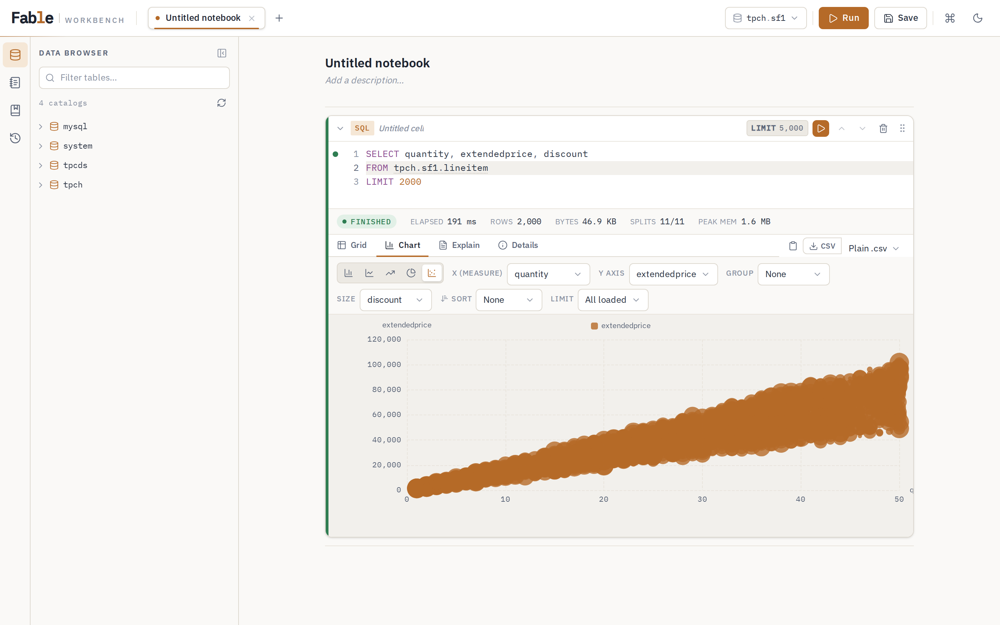 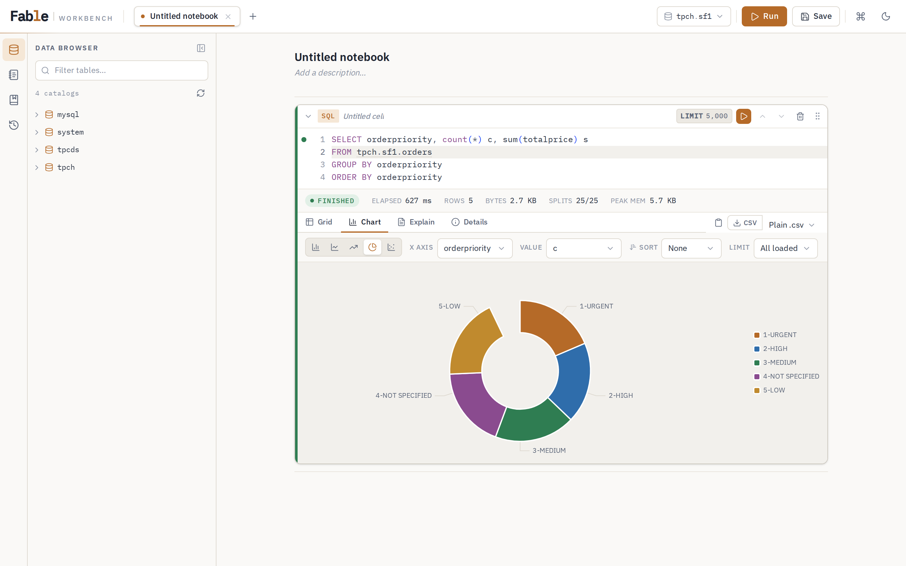

---

## 8. ダウンロードとコピー

結果ペイン右上に、コピーとダウンロードのコントロールがあります。

- **CSV ダウンロード**: 既定は **CSV (zip)**（zip 圧縮）。右の ▾ から **Plain .csv**
  （無圧縮）に切り替えられます。ダウンロードはサーバーからストリーム配信され、保存済み結果があればそれを使います。
  保存済み結果が無い場合は、必要ならクエリを再実行しながら流すため、画面に出ている truncated の上限とは独立に**全件**を取得できます。
- **XLSX ダウンロード**: Excel 形式の workbook をストリーム配信します。
  Excel のワークシート上限に合わせ、1,048,576 行を超える結果はサーバーが拒否します。
- **外部エクスポート**: **Export** メニューから S3 へ CSV gzip または XLSX を保存できます。
  Google Sheets を選ぶと新しい spreadsheet を作成し、ログイン principal の email に writer 権限で共有します。
  Google Sheets は 1,000 万セル上限の 80% を超える結果を拒否します。
- **クリップボードへコピー**: クリップアイコンで、結果を **TSV（text/plain）と HTML
  テーブル（text/html）**の両方として書き込みます。表計算ソフトに貼ると表が保たれます。
  （`ClipboardItem` 非対応の古いブラウザでは TSV のみ。）

---

## 9. データブラウザ

左サイドバーの **Data** パネルは、catalog → schema → table → column のツリーです
（展開時に遅延ロード、5 分キャッシュ）。

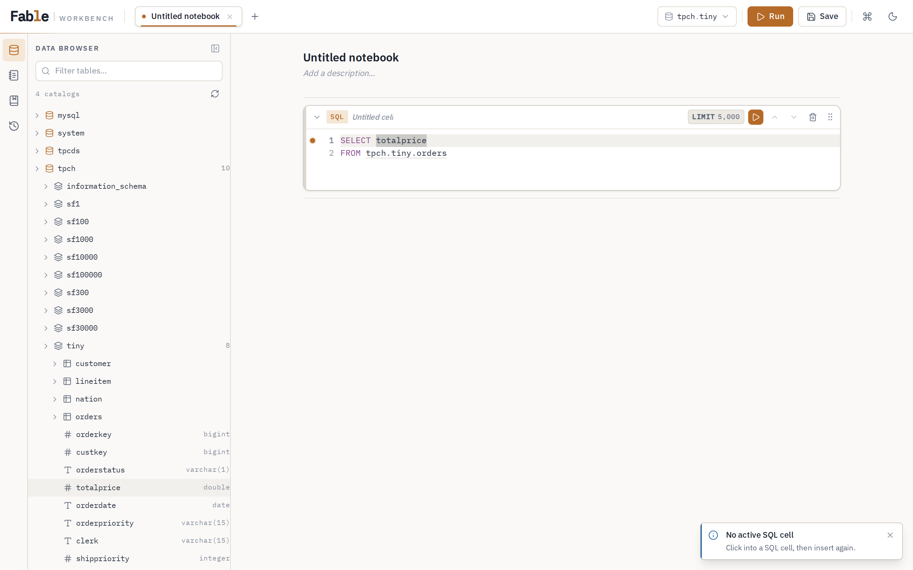

- **挿入** — テーブルをクリックするとカーソル位置に**コンテキスト相対のテーブル名**を
  挿入します（上部バーの catalog.schema と一致する部分は省略）。カラムをクリックすると
  カラム名を挿入します。
- **詳細ポップオーバー** — テーブル行にカーソルを乗せると出る ⓘ ボタンで、カラム一覧
  （型・コメント）と**サンプル 10 行**を表示します。ヘッダーの **SELECT template** ボタンで、
  そのテーブルの `SELECT col1, col2 … FROM t LIMIT 100` 雛形を新規セルに追加します。
- **フィルター** — 上部の検索欄でツリーを絞り込みます。読み込み済みのブランチで一致した
  パスは自動展開されます。
- **更新** — パネル右上の更新アイコンで、サーバーのメタデータキャッシュを再読み込みします。

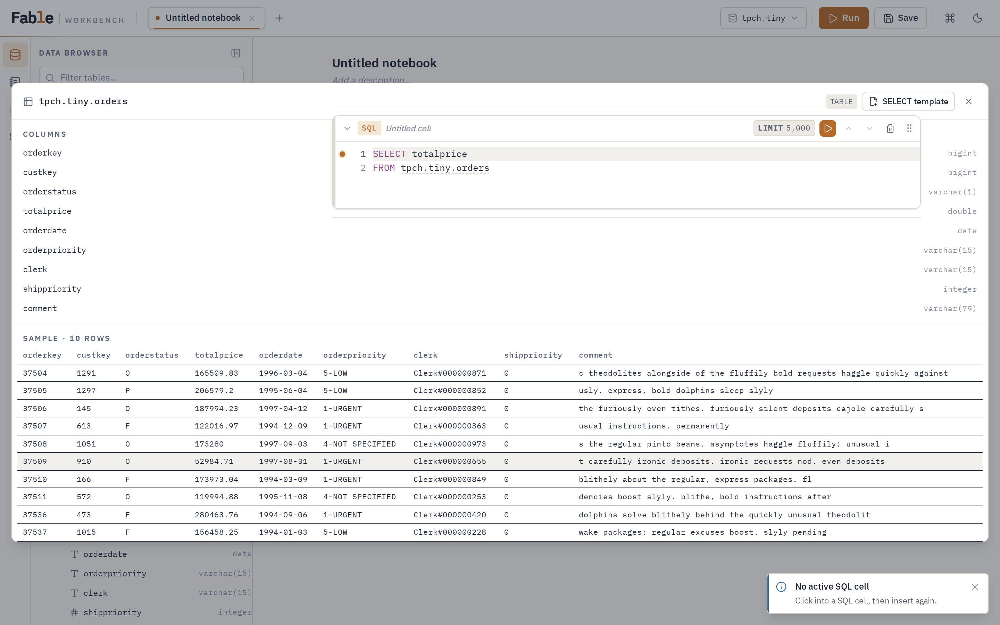

---

## 10. 履歴と保存クエリ

### 10.1 履歴（History パネル）

実行したクエリは自動的に履歴へ記録されます。

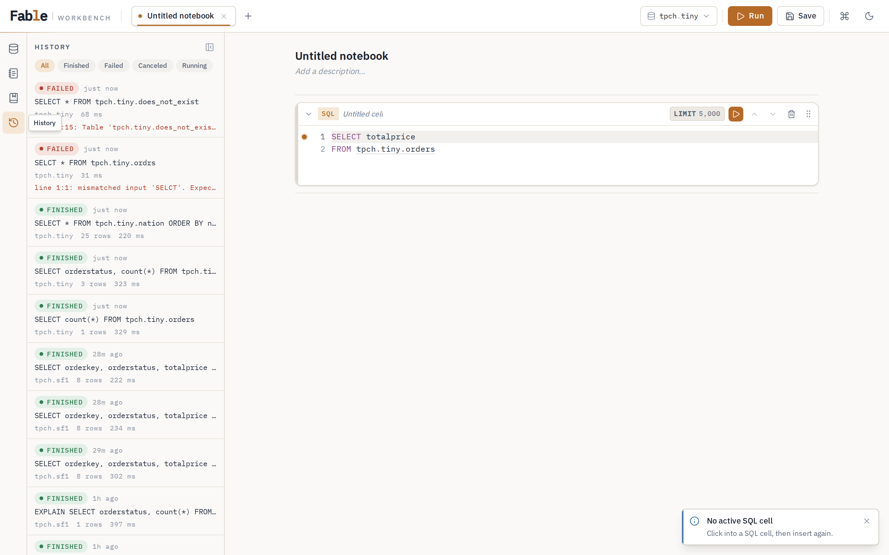

- 上部の **state チップ**（All / Finished / Failed / Canceled / Running）で絞り込み。
- 行を開くと、ステートメント全文とメタデータが見えます。**Insert**（カーソル位置へ挿入）/
  **New cell**（新規セルへ）が選べます。
- 運用者が結果保存を有効にしている場合、保存済み結果が残っている履歴には **Open result** が表示されます。
  **Open result** はクエリを再実行せず、新しい SQL セルに保存済み結果を復元します。
- 末尾の **Load more** で 50 件ずつ追加読み込み。

### 10.2 保存クエリ（Saved パネル）

よく使う SQL を名前付きで保存できます。

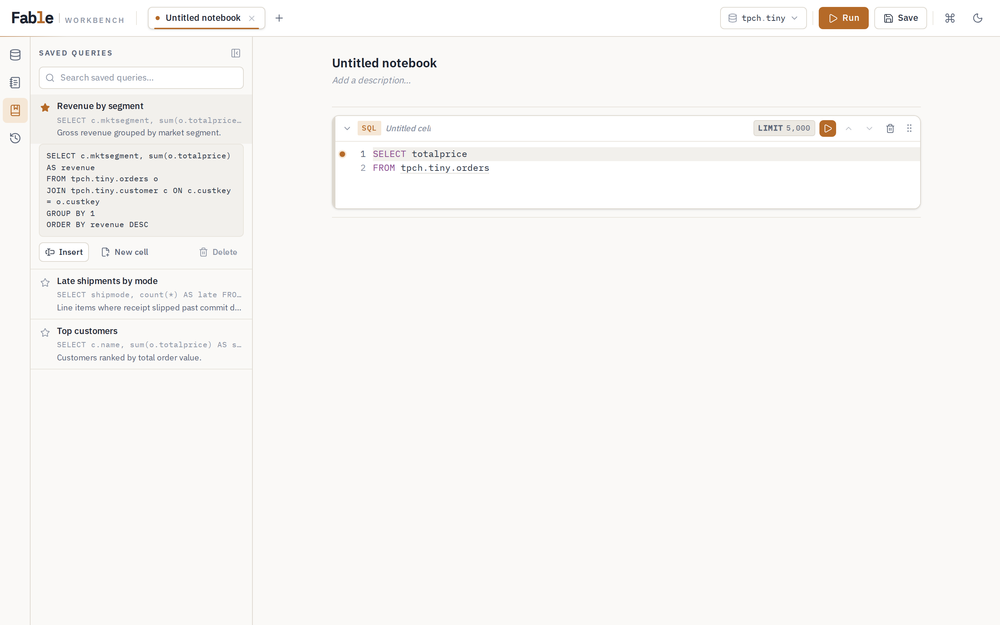

- **★（お気に入り）**トグル、**Insert**（カーソル位置へ）、**New cell**（新規セルへ）、
  **Delete**（削除）。
- 上部の検索欄で名前・説明を検索できます。

### 10.3 ドキュメント共有

保存済みクエリと Notebook を他ユーザーへ共有できます。共有の設定変更と削除は
**所有者 (owner) のみ**が行えます。

#### Share ボタンの場所

| 対象           | 場所                                                              |
| -------------- | ----------------------------------------------------------------- |
| **保存クエリ** | Saved パネルで行を展開したときの **Share** ボタン (所有者のみ)    |
| **Notebook**   | Notebook を開いたときのヘッダー右側 **Share** ボタン (所有者のみ) |

#### 共有先の種類と一致規則

Share モーダルで共有先を追加します。種類は次の 3 つです。

| 種類      | Subject に入力する値               | 一致規則                 |
| --------- | ---------------------------------- | ------------------------ |
| **User**  | ユーザー id (principal)            | 完全一致                 |
| **Group** | SSO グループ名                     | 大文字小文字を区別しない |
| **Role**  | RBAC ロール名 (`rbac.yaml` で定義) | 大文字小文字を区別しない |

共有先は最大 **50 件**までです。Save で共有一覧を**全置換**します (既存の共有先を
残したい場合は、モーダル内の一覧をそのまま含めて保存してください)。

#### view と edit の違い

| 権限     | 保存クエリ                                                             | Notebook                                                               |
| -------- | ---------------------------------------------------------------------- | ---------------------------------------------------------------------- |
| **view** | SQL を閲覧し、Insert / New cell で Notebook に取り込める               | **Read-only** 表示。ローカルでセルを編集してもサーバーへは保存されない |
| **edit** | 内容を更新できる (お気に入り `isFavorite` は owner の状態が維持される) | 内容を編集してサーバーに保存できる                                     |

共有された項目には一覧に **shared by \<owner\> (view)** または **(edit)** バッジが
付きます。

#### クエリ実行について

共有は SQL 文の閲覧と編集権限だけを付与します。共有された SQL を実行するときの
データアクセスは、**あなた自身の RBAC** (datasource allowlist、Query Guard) で
評価されます。owner の権限がそのまま移譲されるわけではありません。

---

## 11. スケジュール

保存した SQL を cron で自動実行する機能です。

### 11.1 パネルの場所

左サイドバーの **Schedules** パネルから操作します（Data / Notebooks / Saved / History と
同じアイコンレール上にあります）。

### 11.2 スケジュールの作成

パネル右上の **+** ボタンをクリックすると作成フォームが開きます。設定項目は次のとおりです。

| 項目                 | 説明                                                                                     |
| -------------------- | ---------------------------------------------------------------------------------------- |
| **名前**             | スケジュールの表示名                                                                     |
| **SQL**              | 実行するクエリ（保存済みクエリの内容をそのまま使うか、直接入力）                         |
| **Catalog / Schema** | クエリを実行する際の既定のカタログ・スキーマ                                             |
| **Cron 式**          | 5 フィールド形式（分 時 日 月 曜日）。プリセットから「毎時」「毎日 AM 9:00」等を選べます |
| **有効**             | 作成直後から有効にするかどうか                                                           |
| **リトライポリシー** | 最大試行回数 / バックオフ秒数 / バックオフ倍率                                           |
| **失敗通知**         | 最終的に `failed` で確定したときに Slack または email へ通知するかどうか                 |

**SQL に構文エラーがある状態では保存できません**。フォーム上でリアルタイムに構文チェックが
行われ、エラーが解消されるまで保存ボタンが無効になります。

失敗通知はリトライが尽きた後の `failed` で 1 回だけ送信されます。
成功時、リトライ中、リトライ後の成功、`blocked` では送信されません。
email を選ぶ場合は宛先を 1 件以上入力してください。

### 11.3 cron プリセット

よく使う間隔はドロップダウンから選択できます（例: 毎分 / 毎時 / 毎日 / 毎週月曜など）。
プリセットを選ぶと cron 式が自動で入力されます。カスタム間隔は直接入力してください。
cron 式はサーバーのローカル時刻で評価されます。

### 11.4 手動実行・有効 / 無効の切り替え

スケジュール一覧の行にある **Run now** ボタンで即時実行できます。トグルスイッチで
有効 / 無効を切り替えられます（無効中の発火はスキップされます）。

### 11.5 実行履歴の見方

スケジュール行の **履歴** ボタンを押すと、直近の実行一覧が表示されます。

| 列               | 意味                                                   |
| ---------------- | ------------------------------------------------------ |
| **status**       | `success` / `failed` / `blocked` / `running`           |
| **attempt**      | 実際に試みた回数（1 から始まり、リトライのたびに増加） |
| **rowCount**     | Trino が返した行数                                     |
| **elapsedMs**    | 実行時間（ミリ秒）                                     |
| **trinoQueryId** | Trino 側のクエリ ID（Trino UI での詳細確認に使用）     |

既定では結果の行データは保存されません。
運用者が結果保存を有効にしている場合は、保存済み結果が失効するまで履歴から再実行なしで開けます。
履歴に記録されるのはステータスと統計情報です。
直近 50 件（運用者設定による）が保持され、それを超えた古い記録は自動で削除されます。

---

## 12. コマンドパレットとショートカット

### 12.1 コマンドパレット（Ctrl/Cmd+K）

コマンドパレットからは主要な操作を検索して実行できます。

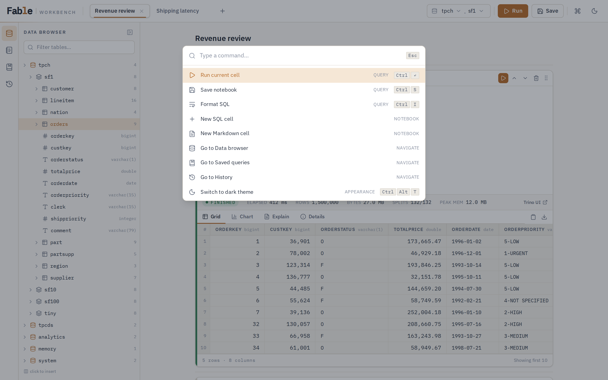

主なコマンド：Run all cells / Save notebook / Save notebook as… / New notebook /
Open notebook… / New SQL cell / New Markdown cell / Go to（Data·Saved·History·Notebooks）/
テーマ切替 / Presentation mode / Keyboard shortcuts。

「Open notebook…」を選ぶと、Notebook 名で検索して開くモードに入ります（Esc で戻る）。

### 12.2 ショートカット一覧

実装の正本（`packages/web/src/hooks/shortcuts.ts`）と一致した一覧です。macOS では Ctrl の
代わりに ⌘ が使えます。

| 操作                     | ショートカット       |
| ------------------------ | -------------------- |
| アクティブセルの実行     | Ctrl/Cmd + Enter     |
| Notebook の保存          | Ctrl/Cmd + S         |
| SQL の整形               | Ctrl/Cmd + I         |
| SQL の整形（別キー）     | Ctrl/Cmd + Shift + F |
| コマンドパレット         | Ctrl/Cmd + K         |
| ライト/ダークテーマ切替  | Ctrl + Alt + T       |
| Presentation mode の切替 | Ctrl/Cmd + Shift + P |

補足：

- **実行（Ctrl/Cmd+Enter）** はエディター内・変数入力欄が所有します。フォーカスが
  どこにもないときだけグローバルに効きます。
- **整形（Ctrl/Cmd+I）** はエディター内ではエディター自身が処理します。エディター外で
  押すと、直近のエディターを整形します。整形は選択範囲または全体に対して行えます。
- この一覧はコマンドパレットの **Keyboard shortcuts** からも開けます。

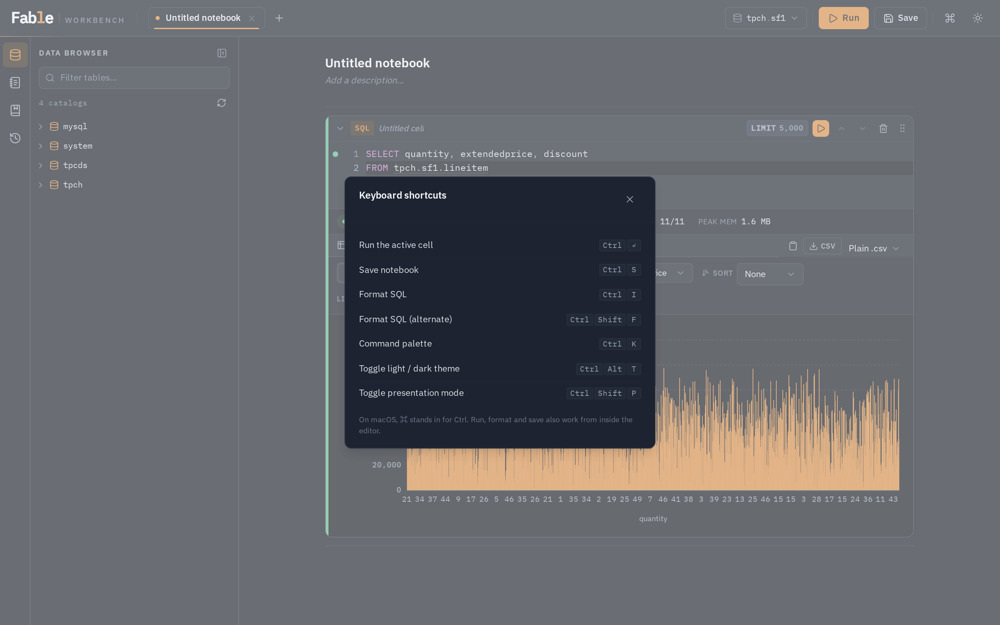

---

## 13. Presentation mode とテーマ切替

### 13.1 Presentation mode

**Ctrl/Cmd+Shift+P**（またはコマンドパレット）で、アクティブな Notebook を読み取り専用の
スライド表示に切り替えます。SQL セルは `--` のコメント見出しで**カード**に分割され、
見出しがカードのタイトルになります。Markdown セルはそのままカードとして表示されます。

### 13.2 テーマ切替

**Ctrl + Alt + T**、または TopBar の月/太陽アイコンで、ライト「warm paper」とダーク
「midnight instrument」を切り替えます。設定はブラウザに保存されます。

---

## 14. SSO 環境での表示

運用者が SSO（oauth2-proxy 前段）を有効にしている場合、

- TopBar の右上の UserChip に**現在のユーザー**（解決されたプリンシパル。メールはツールチップ）が表示されます。
  UserChip を開くと、自分に解決された role、permissions、アクセス可能な datasource を確認できます。
  SSO なし（`authMode=none`）の環境では UserChip は表示されません。
- セッションが切れたり、プロキシを経由せず直接アクセスしたりすると、全画面に
  **「認証が必要です」** が表示されます。「再読み込み」で SSO のログインフローに戻ります。

この画面が出たら、通常の入口（社内のポータル URL など）から入り直してください。Notebook・
保存クエリ・履歴は**ユーザーごと**に分離されており、他のユーザーのデータは見えません。
